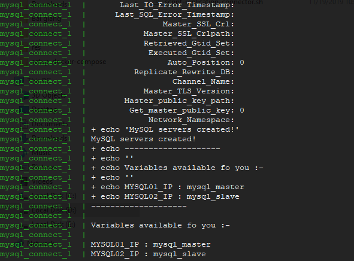
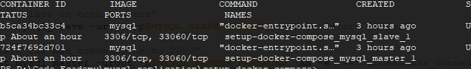

# MySQL Replication

Build MySQL replication between master and slave. Use docker compose to build mysql host. Need Docker Engine installed on PC. Docker compose will get `mysql`
image from Docker Hub.

## Requirement

Installed:
- Window/ Linux OS.
- Docker Engine 

## Start Docker

```sh
git clone https://github.com/vtsspace/mysql-relication.git
cd mysql-relication
docker-compose up
```

After waiting 3-5 mins. You will have result.



## Test

Access to **master** node to create new databasse. But we need know what docker container running is master. 

```sh
docker ps
```


In this image, will see master.

```sh
# access master docker container
docker exec -u root -it 724f7692d701 /bin/bash

# connect to mysql
# `PpA4q38F` is password MYSQL MASTER that config in docker compose.
mysql -u root -pPpA4q38F    
create databasse test;
```

Now access *slave* node to check dabase `test` synced?

```sh
# access master docker container
docker exec -u root -it 724f7692d701 /bin/bash

# connect to mysql
# `uSA8dppL` is password MYSQL SLAVE that config in docker compose.
mysql -u root -puSA8dppL
show databasse;
```

We should `test` database was created in *slave*.

## Notes

If you do not use docker compose that install each docker each servers. We not need `mysql_connect` in `docker-compose.yml`. But you still must run `./script-replication-connector.sh`. It help you config connect between `master` and `slave` node.
